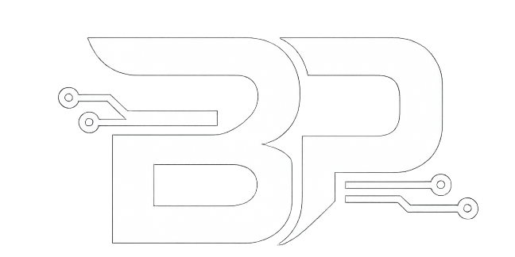

  

# Hey there! I'm Binuk Pinsara 

  <strong>Full-Stack Developer | Software Engineering Undergraduate</strong>

  I am a passionate IT student specializing in Software Engineering. I focus on building robust full-stack applications, mobile apps, and solving real-world problems through clean, efficient code.

  

---

## Tech Stack & Tools

### 🌐 Frontend Development

  

### Backend & Languages

  

### Database, Mobile & DevOps

  

---

## GitHub Status & Achievements

  
  

### My Official Achievements
Since external image badges can be unstable, here is a clean, permanent showcase of the official achievements earned on this account:

| Achievement | Name | Description |
| :---: | :---: | :--- |
|  | **Pull Shark (x2)** | Merged pull requests that successfully introduced code into repositories. |
|  | **Quick Draw** | Closed an issue or pull request within 5 minutes of opening it. |
|  | **YOLO** | Merged a pull request without a code review or automated checks. |

---

## 🤝 Connect with Me

Feel free to reach out if you want to collaborate on projects or just talk about software engineering!

  
  

---

